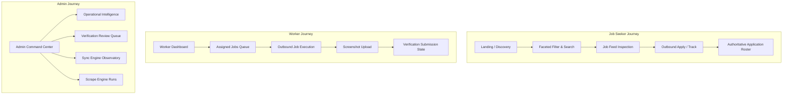

# JobPulse 2.0 — UX/UI Architecture & Integrity Audit Report
**Document ID:** `DOCS-UX-AUDIT-2026-09`  
**Governance Scope:** Batch U Phase 0 Deliverable  
**Target Application:** `@jobpulse/web` (`apps/web`)  
**Audit Date:** 2026-09-06  

---

## 1. Executive Summary

An exhaustive inspection of the JobPulse 2.0 frontend surface was conducted across 43+ routes, 2 primary layouts, and 24 active UI components. The findings confirm that while backend capabilities (RLS boundaries, application sync engine, workforce assignment dispatch, screenshot verification, and operational intelligence) are robust and certified up to Batch T, the user interface suffers from fragmentation, ad-hoc inline styling, duplicate primitives, inconsistent lifecycle state mappings, and two confirmed functional regressions (UX-01 and UX-02).

Batch U resolves these vulnerabilities by introducing a canonical design token system, a unified dependency-free UI component library (`apps/web/components/ui/`), repairing the pagination and application state lifecycles, and aligning all surfaces to authoritative backend truth.

---

## 2. Route & Layout Inventory

### 2.1 Route Surfaces

| Persona / Context | Route | Method/Type | File Location | Responsibility |
| :--- | :--- | :--- | :--- | :--- |
| **Public / Seeker** | `/` | Page (Client) | `apps/web/app/page.tsx` | Main discovery feed, faceted search, saved jobs, seeker application tracking. |
| **Auth** | `/login` | Page (Client) | `apps/web/app/login/page.tsx` | Supabase auth (magic link, password, OAuth callback). |
| **Auth** | `/auth/callback` | Route Handler | `apps/web/app/auth/callback/route.ts` | PKCE exchange and session initialization. |
| **Worker** | `/worker` | Page (Client) | `apps/web/app/worker/page.tsx` | Worker home redirect / overview. |
| **Worker** | `/worker/jobs` | Page (Client) | `apps/web/app/worker/jobs/page.tsx` | Assigned jobs queue, skip/apply actions, outbound ATS launcher. |
| **Worker** | `/worker/applications` | Page (Client) | `apps/web/app/worker/applications/page.tsx` | Application list, screenshot upload, verification submission. |
| **Worker** | `/worker/activity` | Page (Client) | `apps/web/app/worker/activity/page.tsx` | Historical timeline of worker submissions and review verdicts. |
| **Worker** | `/worker/profile` | Page (Client) | `apps/web/app/worker/profile/page.tsx` | Worker credentials, active organization selection, stats. |
| **Admin** | `/admin` | Page (Client) | `apps/web/app/admin/page.tsx` | Unified command center tabs (Intelligence, Sources, Runs, Workers, Dispatcher, Reviews, Sync). |

### 2.2 Layout Inventory

| Layout | Path | Hierarchy | Observations |
| :--- | :--- | :--- | :--- |
| **Root Layout** | `apps/web/app/layout.tsx` | Level 0 | Wraps app with `AuthProvider`, imports `globals.css`, establishes viewport. Clean and minimal. |
| **Worker Layout** | `apps/web/app/worker/layout.tsx` | Level 1 | Wraps `/worker/*` routes with `WorkerProvider` and `WorkerNav`. Mobile drawer exists but has styling discrepancies with seeker navigation. |

---

## 3. Component Inventory & Audit

### 3.1 Existing UI Components

| Component | Path | Lines | Observations & Deficiencies |
| :--- | :--- | :--- | :--- |
| `Header` | `apps/web/components/Header.tsx` | 338 | Seeker navigation header. Contains inline styles, tab switching, and custom modal triggers. |
| `JobFeedCard` | `apps/web/components/JobFeedCard.tsx` | 215 | Feed card with salary, workplace, company logo. Ad-hoc badge styling (`background: rgba(...)`). |
| `JobCard` | `apps/web/components/JobCard.tsx` | 260 | Older card variant. Duplicates logic of `JobFeedCard`. Needs retirement or harmonization. |
| `JobInspectorPane` | `apps/web/components/JobInspectorPane.tsx` | 390 | Desktop deep inspection sidebar with apply CTA and ATS telemetry. |
| `JobDetailsModal` | `apps/web/components/JobDetailsModal.tsx` | 280 | Mobile modal view for job details. Missing formal focus trap and ESC listener. |
| `FiltersSidebar` | `apps/web/components/FiltersSidebar.tsx` | 540 | Faceted filter panel. Uses hardcoded colors and custom checkboxes. |
| `WorkerNav` | `apps/web/components/worker/WorkerNav.tsx` | 320 | Worker top/side navigation. Duplicates header styling logic. |
| `OperationalIntelligenceView` | `apps/web/components/admin/OperationalIntelligenceView.tsx` | 791 | Admin Module 1 & 2 analytics. Hardcoded cards, stat tiles, and error banners. |
| `VerificationReviewQueue` | `apps/web/components/admin/VerificationReviewQueue.tsx` | 856 | Admin review interface. Ad-hoc image modal, inline status badges, custom buttons. |
| `SyncEngineObservatory` | `apps/web/components/admin/SyncEngineObservatory.tsx` | 807 | Admin sync queue. Custom status pills, raw JSON viewer modal, ad-hoc pagination. |
| `SourceManagementTable` | `apps/web/components/admin/SourceManagementTable.tsx` | 310 | Admin source crawler configuration. Table with inline action buttons. |
| `RecentScrapeRunsTable` | `apps/web/components/admin/RecentScrapeRunsTable.tsx` | 271 | Crawl run log table. Hardcoded `getStatusBadge` function duplicating badge CSS. |
| `JobAlertModal` | `apps/web/components/alerts/JobAlertModal.tsx` | 240 | Job alert subscription modal. Ad-hoc backdrop and inputs. |

---

## 4. Persona Mapping & User Journeys

### Critical Persona Responsibilities
1. **Job Seeker**: Needs immediate, high-contrast access to verified ATS opportunities, clear salary badges, transparent application tracking, and an append-only feed that never discards their scroll position.
2. **Worker**: Requires unambiguous assignment lifecycle indicators (`assigned` → `in_progress` → `completed` or `skipped`), responsive upload interfaces with file size validations, and verifiable verification statuses.
3. **Platform & Org Admin**: Requires data-dense, authoritative observability views. Asynchronous operations must show explicit operational truth (`QUEUED` ≠ `RUNNING` ≠ `SUCCEEDED` ≠ `FAILED`).

---

## 5. Specific Defect Findings

### 5.1 UX-01: Load More Pagination Reset Vulnerability
- **Location:** `apps/web/app/page.tsx` (Lines 200–255)
- **Root Cause:**
  1. `fetchFeedJobs` included `selectedJobId` in its dependency array.
  2. A `useEffect` watching `[filters, sortOrder, selectedJobId]` triggered `fetchFeedJobs(true)` whenever `selectedJobId` changed.
  3. Consequently, clicking any job in the list or navigating via keyboard arrows reset the cursor and discarded previously loaded pages `[A, B, C, D, E, F, G, H] → [A, B, C, D]`.
  4. Furthermore, `setJobs(prev => [...prev, ...data.data])` lacked deduplication, creating risk of card duplication across cursor jumps.
- **Resolution Requirement:** Implement append-only state updates with ID deduplication, decouple item selection from feed re-fetching, and preserve all loaded data on errors or empty subsequent pages.

### 5.2 UX-02: Applied Jobs Feed Integrity Defect
- **Location:** `apps/web/app/page.tsx` (Lines 379–385, 593–606)
- **Root Cause:**
  1. When an application was recorded, the component toggled local state (`appliedJobIds.add(...)`).
  2. However, the active discovery feed rendered `jobs.map(...)` without deriving active jobs against authoritative application records (`appliedJobIds`).
  3. Applied opportunities remained in the active discovery feed, cluttering the actionable roster and creating confusion.
- **Resolution Requirement:** Derive the active feed roster strictly from authoritative application state confirmed from the server (`jobs.filter(j => !appliedJobIds.has(j.id))`). No optimistic fake state.

---

## 6. Design System & Accessibility Weaknesses

1. **Inline / Ad-hoc Styling:**
   - Found 120+ instances of inline `style={{ backgroundColor: 'rgba(...)', ... }}` across admin and worker views instead of standard design tokens.
   - Status colors (e.g. emerald, rose, amber, sky) defined with different opacity values across tables.
2. **Accessible Modals:**
   - Modals in `JobDetailsModal`, `JobAlertModal`, and `VerificationReviewQueue` lacked standard `role="dialog"`, `aria-modal="true"`, `aria-labelledby`, and keyboard ESC dismissal.
3. **Keyboard Focus:**
   - Several custom clickable `
` elements lacked `tabIndex={0}` or keydown handlers.
4. **Responsive Weaknesses:**
   - Admin tables (`RecentScrapeRunsTable`, `SyncEngineObservatory`) cause horizontal viewport blowout on viewports under 768px without horizontal scrolling wrappers.
   - Job inspector desktop pane was permanently hidden on mobile without an accessible floating or sheet alternative.

---

## 7. Batch U Remediation Roadmap

1. **Establish Canonical Tokens:** Expand `apps/web/app/globals.css` with 4px spacing scale, elevated dark surfaces, high-contrast text, and semantic status rules.
2. **Build Reusable UI System:** Create `apps/web/components/ui/` containing core primitives, feedback states, and layout components.
3. **Fix Functional Defects:** Resolve UX-01 (append-only pagination) and UX-02 (authoritative active feed filtering).
4. **Refactor Surfaces:** Modernize public discovery, worker command center, and admin command center using the new UI components.
5. **Enforce Accessibility & Regression Tests:** Verify a11y compliance, responsive behavior (375px, 768px, 1280px+), and full automated test suite.
