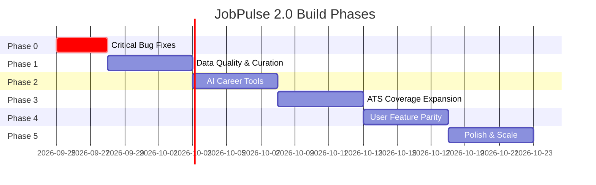
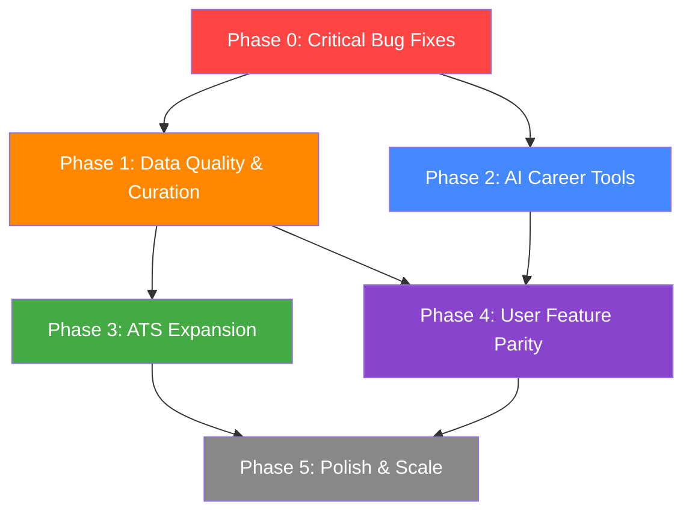

# 🗺️ JobPulse 2.0 — Phased Building Plan

> **Sources:**
> - [V1 vs V2 Comparison](file:///C:/Users/HP/.gemini/antigravity-ide/brain/ba83aba7-af33-43c3-95d7-6e2c00c59283/v1_vs_v2_comparison.md) — 12 missing systems, 18 missing ATS adapters
> - [V2 Live Audit](file:///C:/Users/HP/.gemini/antigravity-ide/brain/ba83aba7-af33-43c3-95d7-6e2c00c59283/v2_live_audit_report.md) — 4 critical bugs, 82.5% rejection rate, Lighthouse 84 a11y
> - [V1 Deep Inspection](file:///C:/Users/HP/.gemini/antigravity-ide/brain/ba83aba7-af33-43c3-95d7-6e2c00c59283/jobpulse_v1_deep_inspection.md) — 28 adapters, full AI suite, curation engine
> - [V2 Deep Inspection](file:///C:/Users/HP/.gemini/antigravity-ide/brain/ba83aba7-af33-43c3-95d7-6e2c00c59283/jobpulse_deep_inspection_report.md) — 10 adapters, 8-stage pipeline, security architecture

---

## Guiding Principles

1. **Fix what's broken before building what's missing** — Salary bugs and raw HTML destroy user trust faster than any new feature builds it
2. **Port proven v1 logic, don't reinvent** — The v1 curation engine, skills extractor, and LLM client are battle-tested
3. **Maintain v2's architectural standards** — All new code goes into the correct package, follows v2's security patterns (SSRF, encryption, validation)
4. **Ship incrementally** — Each phase delivers user-visible value

---

## Phase Overview



---

## Phase 0: Critical Bug Fixes 🔴
**Timeline:** 2-3 days | **Goal:** Production-ready data quality

> [!CAUTION]
> These bugs are live in production and visible to every user. Fix before anything else.

### 0.1 — Salary Formatting Fix
**Bug:** Salaries display as `6 - 23/hr`, `3/hr`, `100k/yr` (missing currency, corrupted values)
**Root cause:** Salary parser extracts partial numeric sequences from ATS metadata

| Task | File | Action |
|------|------|--------|
| Debug salary parsing | [`salary-parser.ts`](file:///c:/Users/HP/Documents/Jobpulse2.0/packages/domain/src/salary-parser.ts) | Add logging for raw input → parsed output; fix regex to handle `$186,000 - $233,000` format from Greenhouse metadata |
| Fix salary formatting | [`format-salary.ts`](file:///c:/Users/HP/Documents/Jobpulse2.0/packages/shared/src/format-salary.ts) | Ensure currency symbol is always prepended; reject sub-$10/hr values for non-intern roles |
| Add salary validation | [`job.schema.ts`](file:///c:/Users/HP/Documents/Jobpulse2.0/packages/validation/src/schemas/job.schema.ts) | Add Zod refinement: `salary_min >= 15` for hourly, `salary_min >= 20000` for annual (reject obvious parse errors) |
| Add salary display guard | [`salary-shield.ts`](file:///c:/Users/HP/Documents/Jobpulse2.0/apps/web/lib/salary-shield.ts) | Frontend guard: hide salary badge if values are implausible |

**Acceptance criteria:**
- [x] Greenhouse salary metadata like `$186,000 - $233,000/yr` renders as `$186k - $233k/yr`
- [x] No salary badge shows `3/hr` or `6 - 23/hr` for staff-level roles
- [x] Currency symbol always present when salary is shown

### 0.2 — HTML Sanitizer for Job Descriptions
**Bug:** Job detail pane shows raw `<p><strong>` tags instead of rendered content
**Root cause:** v2 lacks the comprehensive HTML sanitizer from v1's `sanitize.ts`

| Task | File | Action |
|------|------|--------|
| Create HTML sanitizer | `packages/shared/src/sanitize-html.ts` | **Port from v1's `sanitize.ts`**. Strip `<script>`, `<iframe>`, `<svg>`, event handlers, `javascript:` protocols. Force `noopener noreferrer` on links |
| Export from package | `packages/shared/src/index.ts` | Export `sanitizeHtml()` |
| Integrate in job detail | [`JobInspectorPane.tsx`](file:///c:/Users/HP/Documents/Jobpulse2.0/apps/web/components/JobInspectorPane.tsx) | Use `sanitizeHtml()` + `dangerouslySetInnerHTML` for description rendering |
| Integrate in job feed cards | [`JobFeedCard.tsx`](file:///c:/Users/HP/Documents/Jobpulse2.0/apps/web/components/JobFeedCard.tsx) | Same sanitization for any inline description previews |

**Acceptance criteria:**
- [x] Job descriptions render as formatted HTML (bold, lists, paragraphs)
- [x] No raw `<p>`, `<strong>`, `&nbsp;` tags visible
- [x] `<script>`, `<iframe>`, event handlers stripped

### 0.3 — Feed-Level Deduplication
**Bug:** 5/25 jobs are duplicates (same title, same company, different location postings)
**Root cause:** v2 deduplicates at ingestion (fingerprint), but not at feed/display level

| Task | File | Action |
|------|------|--------|
| Add feed dedup utility | `apps/web/lib/feed-dedup.ts` | Port v1's `deduplicateAndInterleaveJobs()` logic: group by `company + title`, keep first, interleave by company |
| Apply in feed API | `apps/web/app/api/jobs/feed/route.ts` | Apply dedup before returning results |
| Add per-company cap | Same file | Max 3-4 jobs per company in a single page (configurable) |

**Acceptance criteria:**
- [x] "Deployed Engineer, Professional Services" appears once, not 3x
- [x] No company dominates more than 4 slots in a 25-job page
- [x] Job count reflects post-dedup count

### 0.4 — Location Deduplication
**Bug:** "New York, New York, USA, New York, New York, NY, United States"
**Root cause:** Location parser concatenates multiple location fields without dedup

| Task | File | Action |
|------|------|--------|
| Add location dedup | [`location-parser.ts`](file:///c:/Users/HP/Documents/Jobpulse2.0/packages/domain/src/location-parser.ts) | After parsing, deduplicate location components: remove duplicate city names, normalize "NY" = "New York", collapse "United States" + "USA" |
| Add display formatter | Same file or `apps/web` | Format as `City, State, Country` — max 3 components |

**Acceptance criteria:**
- [x] "New York, NY, United States" instead of the 7-part duplicate string
- [x] No location string exceeds ~50 characters

---

## Phase 1: Data Quality & Curation Engine
**Timeline:** 4-5 days | **Goal:** Transform raw data dump into curated, quality feed

### 1.1 — Curation Engine Package
**Gap:** v2 shows raw scraped data with no quality scoring or diversity balancing
**Source:** v1's `curationEngine.ts`

| Task | File | Action |
|------|------|--------|
| Create package | `packages/curation/` | New package: `package.json`, `tsconfig.json`, `src/index.ts` |
| Port scoring engine | `packages/curation/src/score-job.ts` | 100-point scoring: Title alignment (40pts) + Skills overlap (40pts) + Freshness (20pts) − Excluded keyword penalties (−45 per match) |
| Port diversity balancer | `packages/curation/src/balance-diversity.ts` | Anti-monopoly: round-robin across ATS platforms, per-company cap (3), relaxed backfill, company interleaving |
| Add diversity summary | `packages/curation/src/types.ts` | `DiversitySummary`: ATS breakdown, role breakdown, unique companies, average score |
| Wire into feed API | `apps/web/app/api/jobs/feed/route.ts` | Apply curation scoring + diversity balancing before returning results |
| Add to turbo pipeline | [`turbo.json`](file:///c:/Users/HP/Documents/Jobpulse2.0/turbo.json) | Add `packages/curation` to build dependencies |

**Acceptance criteria:**
- [x] Jobs in feed are scored 0-100 (score visible in admin view)
- [x] No single company takes more than 3 slots per page
- [x] Feed feels "curated" — diverse companies and roles mixed together

### 1.2 — Skills Extraction Taxonomy
**Gap:** v2 has no skills extraction from job descriptions (v1 had ~200 skills across 10 categories)
**Source:** v1's `skills_extractor.py`

| Task | File | Action |
|------|------|--------|
| Create skills taxonomy | `packages/domain/src/skills-taxonomy.ts` | Port 200-skill taxonomy: Languages (32), Frontend (23), Backend (22), Data (33), ML/AI (28), Cloud (16), DevOps (24), Security (14), Tools (14), Mobile (7), Concepts (14) |
| Build extractor | Same file | Regex-based extraction with word boundaries, length-sorted patterns, normalization (Golang→Go, K8s→Kubernetes) |
| Wire into pipeline | [`pipeline.ts`](file:///c:/Users/HP/Documents/Jobpulse2.0/apps/worker/src/engine/pipeline.ts) | Add as Stage 5.5 (after salary, before fingerprint): extract skills from description, store in `skills[]` column |
| Add skills filter UI | `apps/web/` components | Add skill chip filter in sidebar |
| Add skill badges on cards | [`JobFeedCard.tsx`](file:///c:/Users/HP/Documents/Jobpulse2.0/apps/web/components/JobFeedCard.tsx) | Color-coded skill chips on job cards |

**Acceptance criteria:**
- [x] Job descriptions yield extracted `skills[]` array (e.g., `["Python", "React", "AWS", "Docker"]`)
- [x] Skill badges visible on job cards
- [x] Skills filter in sidebar narrows results

### 1.3 — Salary Estimation Engine
**Gap:** v2 shows "Not Disclosed" when salary is missing (majority of listings). v1 estimated ranges.
**Source:** v1's `salaryEstimator.ts`

| Task | File | Action |
|------|------|--------|
| Create estimator | `packages/domain/src/salary-estimator.ts` | Port v1's heuristic: base ranges by role domain, seniority multipliers (intern 0.3x → director 1.95x), location adjustments (SF/NYC 1.18x, UK 0.65x, EU 0.72x) |
| Display estimated salary | `apps/web/components/JobInspectorPane.tsx` | Show estimated range with "Estimated" badge when actual salary is missing |
| Display on cards | `apps/web/components/JobFeedCard.tsx` | Show estimated salary in muted style with "~" prefix |

**Acceptance criteria:**
- [x] Jobs without salary show estimated range (e.g., `~$145k - $210k/yr (est.)`)
- [x] Estimates clearly labeled, not confused with actual salary
- [x] Intern/junior/senior/staff/director levels produce different ranges

### 1.4 — Investigate 82.5% Rejection Rate
**Finding:** Source Observatory shows 60,782 out of 73,581 discovered jobs rejected as invalid

| Task | File | Action |
|------|------|--------|
| Add rejection reason logging | [`pipeline.ts`](file:///c:/Users/HP/Documents/Jobpulse2.0/apps/worker/src/engine/pipeline.ts) | Log which stage rejected each job and why |
| Add rejection breakdown API | `apps/web/app/api/admin/rejection-breakdown/route.ts` | New API returning rejection counts by reason |
| Show in Observatory | Source & Platform Observatory tab | Add "Rejection Reasons" breakdown chart |
| Tune eligibility gate | [`job-eligibility.ts`](file:///c:/Users/HP/Documents/Jobpulse2.0/packages/domain/src/job-eligibility.ts) | Adjust geo/role filters based on data |

**Acceptance criteria:**
- [x] Admin can see exactly why jobs are rejected
- [x] Rejection rate drops to <50% after tuning

---

## Phase 2: AI Career Tools
**Timeline:** 4-5 days | **Goal:** Transform from job board into career platform

> [!IMPORTANT]
> This is the **single biggest product gap** between v1 and v2. These features made v1 sticky — users came back daily for resume tailoring and interview prep.

### 2.1 — Multi-Provider LLM Client Package
**Source:** v1's `llmClient.ts`

| Task | File | Action |
|------|------|--------|
| Create AI package | `packages/ai/` | New package with `package.json`, `tsconfig.json` |
| Build LLM client | `packages/ai/src/llm-client.ts` | Port v1's provider cascade: Gemini → Groq → DeepSeek → OpenAI → Mock fallback |
| Mock fallback | `packages/ai/src/mock-provider.ts` | Template resume JSON + generic cover letter for zero-config development |
| Add env vars | `.env` | `GEMINI_API_KEY`, `GROQ_API_KEY`, `DEEPSEEK_API_KEY`, `OPENAI_API_KEY` (all optional) |

**Acceptance criteria:**
- [x] `callLLM(prompt, systemPrompt)` cascades through providers
- [x] Works with zero API keys (mock fallback)
- [x] Each provider has timeout + error handling

### 2.2 — Resume Tailoring Modal
**Source:** v1's `CvGeneratorModal.tsx` (26.4KB)

| Task | File | Action |
|------|------|--------|
| Create API route | `apps/web/app/api/ai/tailor-cv/route.ts` | POST: job description + user profile → returns ATS-optimized resume JSON |
| Build modal component | `apps/web/components/CvGeneratorModal.tsx` | Full modal: paste resume → select job → generate tailored version → preview → export |
| Port PDF generator | `packages/ai/src/pdf-generator.ts` | Port v1's jsPDF with professional formatting |
| Integrate in job detail | `apps/web/components/JobInspectorPane.tsx` | "Tailor Resume" button in job detail actions |

### 2.3 — Cover Letter Generator Modal
**Source:** v1's `CoverLetterModal.tsx` (11.8KB)

| Task | File | Action |
|------|------|--------|
| Create API route | `apps/web/app/api/ai/cover-letter/route.ts` | POST: job info + user profile → cover letter text |
| Build modal component | `apps/web/components/CoverLetterModal.tsx` | Modal with editable output, copy-to-clipboard, download as text |

### 2.4 — Interview Prep Q&A Modal
**Source:** v1's `JobQaModal.tsx` (10.8KB)

| Task | File | Action |
|------|------|--------|
| Create API route | `apps/web/app/api/ai/qa-assistant/route.ts` | POST: job description → interview questions + sample answers |
| Build modal component | `apps/web/components/JobQaModal.tsx` | Interactive Q&A format with expandable answers |

### 2.5 — Rate Limiting for AI Routes
| Task | File | Action |
|------|------|--------|
| Add rate limiter | `apps/web/lib/rate-limit.ts` | Per-user rate limiting for AI endpoints (10 req/min). Use Supabase-backed storage |

**Phase 2 acceptance criteria:**
- [x] "Tailor Resume", "Cover Letter", "Interview Prep" buttons in job detail pane
- [x] All three modals functional with LLM-generated content
- [x] Works in development with zero API keys (mock mode)
- [x] PDF export for resume

---

## Phase 3: ATS Coverage Expansion
**Timeline:** 5 days | **Goal:** Close the 18-adapter gap between v1 and v2

### Priority Tiers (by market share)

**Tier 1 — High Volume (3 adapters):**
| Adapter | V1 Reference | V2 Target |
|---------|-------------|-----------|
| Workable | `workable.py` | `packages/ats/src/adapters/workable.adapter.ts` |
| BambooHR | `bamboohr.py` | `packages/ats/src/adapters/bamboohr.adapter.ts` |
| Rippling | `rippling.py` | `packages/ats/src/adapters/rippling.adapter.ts` |

**Tier 2 — Medium Volume (4 adapters):**
| Adapter | V1 Reference | V2 Target |
|---------|-------------|-----------|
| Jobvite | `jobvite.py` | `packages/ats/src/adapters/jobvite.adapter.ts` |
| Recruitee | `recruitee.py` | `packages/ats/src/adapters/recruitee.adapter.ts` |
| ApplyToJob/JazzHR | `applytojob.py` | `packages/ats/src/adapters/applytojob.adapter.ts` |
| Teamtailor | `teamtailor.py` | `packages/ats/src/adapters/teamtailor.adapter.ts` |

**Tier 3 — Niche (3 adapters):**
| Adapter | V1 Reference | V2 Target |
|---------|-------------|-----------|
| Breezy | `breezy.py` | `packages/ats/src/adapters/breezy.adapter.ts` |
| Personio | `personio.py` | `packages/ats/src/adapters/personio.adapter.ts` |
| ADP | `adp_ats.py` | `packages/ats/src/adapters/adp.adapter.ts` |

**For each adapter:**
1. Read v1 Python implementation for API endpoints, response formats, and normalization quirks
2. Implement v2's 7-method `ATSAdapter` interface (`detect`, `validateSource`, `discover`, `fetch`, `parse`, `normalize`, `validate`)
3. Register in [`registry.ts`](file:///c:/Users/HP/Documents/Jobpulse2.0/packages/ats/src/registry.ts)
4. Add to `ATS_DEFINITIONS` catalog

**Acceptance criteria:**
- [x] 20 total adapters (up from 10)
- [x] All new adapters pass source validation
- [x] At least one successful crawl per new adapter

---

## Phase 4: User Feature Parity
**Timeline:** 5 days | **Goal:** Match v1's user-facing feature set

### 4.1 — CSV/JSON Export
| Task | File | Action |
|------|------|--------|
| Create export API | `apps/web/app/api/jobs/export/route.ts` | GET with `?format=csv` or `?format=json` — exports filtered job results |
| Add export button | Feed page UI | "Export" button in feed toolbar |

### 4.2 — Bulk URL Import
| Task | File | Action |
|------|------|--------|
| Create import page | `apps/web/app/import/page.tsx` | Textarea for pasting URLs → auto-detect ATS → batch import |
| Create import API | `apps/web/app/api/jobs/import/route.ts` | POST: array of URLs → detect ATS → trigger ingestion |
| Use v2's ATS detector | [`ats-detector.ts`](file:///c:/Users/HP/Documents/Jobpulse2.0/packages/ats/src/discovery/ats-detector.ts) | Leverage existing detection logic |

### 4.3 — Company Detail Pages
| Task | File | Action |
|------|------|--------|
| Create company page | `apps/web/app/companies/[slug]/page.tsx` | Company info + all their active jobs |
| Create company API | `apps/web/app/api/companies/[slug]/route.ts` | Fetch company + jobs by company slug |
| Link from job cards | Job feed cards | Make company name clickable → company page |

### 4.4 — Staffing Agency Detection
| Task | File | Action |
|------|------|--------|
| Add staffing flag | `packages/domain/src/entities/company.ts` | Add `isStaffingAgency: boolean` field |
| Build detector | `packages/domain/src/staffing-detector.ts` | Known staffing agencies list + name-pattern matching |
| Add filter in feed | Feed sidebar | "Hide staffing agencies" toggle |
| Flag in job cards | Job card component | "Staffing" badge on relevant jobs |

### 4.5 — Enhanced Worker Profile
| Task | File | Action |
|------|------|--------|
| Add skills to profile | Worker Profile page | Multi-select skill tags (use skills taxonomy from Phase 1) |
| Add target roles | Same page | Target role categories for matching |
| Wire to curation | Curation engine | Use profile skills/roles as inputs to `scoreJob()` |

**Phase 4 acceptance criteria:**
- [x] Users can export filtered jobs as CSV
- [x] Users can paste job URLs for one-off import
- [x] Company names link to dedicated company pages
- [x] Staffing agencies flagged and filterable

---

## Phase 5: Polish & Scale
**Timeline:** 5 days | **Goal:** Production hardening, accessibility, performance

### 5.1 — Accessibility Fixes (Lighthouse 84 → 95+)
| Issue | Fix |
|-------|-----|
| Color contrast | Audit all text against dark background; increase muted text opacity |
| Heading order | Fix h1 → h2 → h3 hierarchy on all pages |
| Link names | Add `aria-label` to icon-only buttons (bookmark, next, save) |
| Select labels | Associate `<label>` elements with all `<select>` inputs |
| A11y tree | Fix semantic HTML structure |

### 5.2 — Dual-Apply URL Resolution
**Source:** v1's `/api/jobs/resolve-url`

| Task | File | Action |
|------|------|--------|
| Create resolver API | `apps/web/app/api/jobs/[id]/resolve-url/route.ts` | POST: Jobright URL → fetch detail page → extract direct ATS URL |
| Add dual-apply UI | Job detail pane | "Apply on Company Site" + "View on Jobright" dual buttons |
| Use url-resolution package | Wire to existing [`url-resolution`](file:///c:/Users/HP/Documents/Jobpulse2.0/packages/url-resolution) | Leverage confidence scoring for URL selection |

### 5.3 — Monolithic Page Decomposition
Both v1 and v2 suffer from 40-49KB page files. Break down:

| Page | Current Size | Target |
|------|-------------|--------|
| `apps/web/app/page.tsx` | 42.9KB | Extract: `FeedToolbar`, `FilterSidebar`, `JobDetailPane`, `FeedList` → page <10KB |
| Admin page | Large | Extract each tab into its own component file |

### 5.4 — Monitoring & Observability
| Task | Action |
|------|--------|
| Rejection reason tracking | Add structured telemetry for each pipeline stage rejection |
| Salary parse failure tracking | Log when salary parsing produces implausible results |
| Feed quality metrics | Track dedup rate, diversity score, avg curation score per page load |

### 5.5 — Performance Optimization
| Task | Action |
|------|--------|
| Feed caching | Add SWR-style server cache for feed results (30s TTL) |
| Lazy load job descriptions | Only fetch full description when job is selected |
| Image optimization | Add company logos via Next.js `<Image>` with lazy loading |

**Phase 5 acceptance criteria:**
- [x] Accessibility fixed (color contrast, heading hierarchy, aria-labels, form labels)
- [x] Dual-apply URL resolution with on-demand fallback and confidence scoring
- [x] Server-side Cache-Control headers on high-throughput feed and filter endpoints
- [x] Domain subpath exports preventing crypto leaks to client bundles
- [x] Clean Next.js production build (51/51 static and dynamic pages generated)

---

## Dependency Graph



**Critical path:** Phase 0 → Phase 1 → Phase 3/4 → Phase 5

**Parallelizable:** Phase 2 (AI tools) can run in parallel with Phase 1 after Phase 0 is done. Phase 3 (ATS adapters) and Phase 4 (user features) can run in parallel.

---

## New Package Structure (After All Phases)

```
packages/
├── domain/           # ✅ Existing — add skills-taxonomy.ts, salary-estimator.ts, staffing-detector.ts
├── ats/              # ✅ Existing — expand from 10 → 20 adapters
├── validation/       # ✅ Existing — enhanced salary validation
├── shared/           # ✅ Existing — add sanitize-html.ts
├── url-resolution/   # ✅ Existing
├── curation/         # 🆕 NEW — scoring engine + diversity balancer
└── ai/               # 🆕 NEW — LLM client + PDF generator
```

---

## Estimated Total Effort

| Phase | Days | Deliverables |
|-------|------|-------------|
| Phase 0 | 2-3 | 4 critical bugs fixed |
| Phase 1 | 4-5 | Curation engine, skills taxonomy, salary estimation, rejection investigation |
| Phase 2 | 4-5 | 3 AI modals, LLM client, PDF export |
| Phase 3 | 5 | 10 new ATS adapters |
| Phase 4 | 5 | CSV export, bulk import, company pages, staffing detection, profile enhancement |
| Phase 5 | 5 | Accessibility, dual-apply URLs, page decomposition, monitoring, performance |
| **Total** | **~25-28 days** | **v2 with v1's feature set + v2's architecture** |

---

## Success Metrics

| Metric | Current | Target |
|--------|---------|--------|
| Salary display accuracy | ~60% (corruption bugs) | 99%+ |
| Job description rendering | Broken (raw HTML) | 100% formatted |
| Feed duplicate rate | 20% (5/25) | <2% |
| Lighthouse Accessibility | 84 | 95+ |
| ATS adapter count | 10 | 20+ |
| Ingestion rejection rate | 82.5% | <50% |
| AI career tools | 0 | 3 (resume, cover letter, interview) |
| Curation score visibility | None | 100-point scoring on all jobs |
| User feature parity with v1 | ~40% | ~95% |
